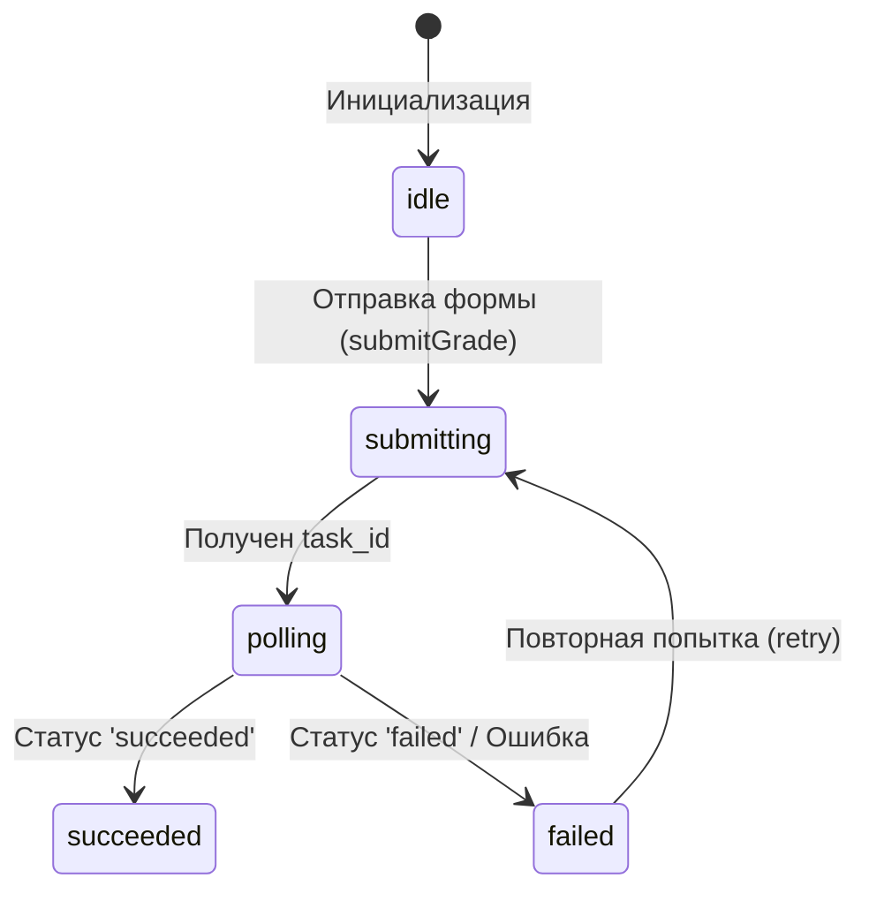

# Архитектура Frontend-приложения EGE Biology Grader

Документ описывает структуру, ключевые паттерны проектирования, управление состоянием, сетевое взаимодействие и инфраструктуру клиентской части сервиса автоматической проверки заданий ЕГЭ по биологии.

---

## 1. Общий обзор проекта

Клиентское приложение представляет собой **Single Page Application (SPA)** на базе **React 19** с типизацией **TypeScript** и сборщиком **Vite 7**. 

Основная задача фронтенда — предоставление интерактивного лендинга с возможностью авторизации (ученик/учитель), профилем пользователя, а также интерфейса для отправки развернутых ответов ЕГЭ (включая текстовые ответы и изображения) на автоматическую проверку ИИ-ассистентом с последующим отображением детального разбора ошибок.

---

## 2. Структура директорий (`src/`)

Исходный код организован по модульному принципу:

```
src/
├── index.tsx              # Точка входа приложения (рендеринг, провайдеры Redux и Google OAuth)
├── App.tsx                # Корневой компонент (определяет структуру страницы и модальные окна)
├── Layout/                # Базовая разметка каркаса страницы
│   ├── Header/            # Шапка сайта (навигация, статус авторизации)
│   └── Footer/            # Подвал сайта
├── sections/              # Крупные функциональные блоки/секции лендинга
│   ├── MainMenu/          # Главный экран (Hero-секция)
│   ├── GrowthStats/       # Интерактивная статистика
│   ├── TaskChecker/       # Демонстрационный модуль проверки заданий ИИ
│   ├── Integration/       # Раздел API-интеграции для партнеров
│   ├── Curators/          # Секция кураторов
│   ├── Log/               # Контейнер для отображения форм входа и регистрации
│   ├── Login/             # Компонент формы входа
│   └── RegisterForm/      # Компонент формы регистрации
├── components/            # Переиспользуемые атомарные UI-компоненты
│   ├── InputForLog/       # Поле ввода для форм с поддержкой валидации и переключения видимости пароля
│   ├── DropDown/          # Выпадающий список (выбор роли, класса и т.д.)
│   ├── ImageUploader/     # Компонент загрузки изображений (заданий, ключей, ответов)
│   ├── TextAreaChecker/   # Многострочное текстовое поле для ввода ответов
│   └── BurgerMenu/        # Мобильное меню навигации
├── CustomHooks/           # Кастомные React-хуки, содержащие изолированную бизнес-логику
│   ├── useTaskChecker.ts  # Логика отправки и опроса (polling) статуса проверки задания
│   ├── useLoginForm.ts    # Управление состоянием и отправкой формы входа
│   ├── useRegisterForm.ts # Управление состоянием и отправкой формы регистрации
│   └── UseScrollLock.ts   # Блокировка прокрутки фона при открытых модальных окнах
├── api/                   # Слой взаимодействия с внешними API
│   ├── client.ts          # Кастомная обертка над fetch с настройками сессий и JSON-парсинга
│   ├── grader.ts          # Клиент для интеграции с модулем проверки (Grader API)
│   └── graderErrors.ts    # Словари ошибок и хелперы для их текстового описания
├── store/                 # Конфигурация Redux-хранилища
│   └── store.ts           # Инициализация store, подключение reducers и middleware
├── slices/                # Срезы состояния Redux Toolkit
│   ├── Auth.ts            # Срез данных пользователя и статуса сессии
│   └── me.ts              # RTK Query эндпоинт для автоматической загрузки профиля
├── types/                 # Типизация TypeScript
│   ├── gradeResult.ts     # Типизация ответов ИИ-проверки
│   └── schemas/           # Zod-схемы валидации полей ввода форм
└── utils/                 # Общие хелперы и стили
    ├── scss/              # Базовая стилизация (variables, mixins, fonts, base reset)
    └── ts/                # Вспомогательные JS/TS функции (например, scrollTo)
```

---

## 3. Сетевое взаимодействие и API-клиенты

### Кастомный клиент (`src/api/client.ts`)
Все запросы к основному бэкенду авторизации осуществляются через единую функцию-обертку `client` на базе нативного `fetch`.
* **Стратегия авторизации**: Проект настроен на сессионную авторизацию (`AUTH_STRATEGY = 'session'`).
* **Session Cookies**: Для всех запросов к основному API автоматически проставляется заголовок `credentials: 'include'`, что обеспечивает передачу авторизационных кук (HttpOnly Cookie) между клиентом и сервером.

### Конфигурация адресов (`src/urls.ts`)
* **URL**: Основной адрес сервиса авторизации. В режиме разработки (DEV) перенаправляет на порт `:3000` локального хоста, в режиме сборки (PROD) — использует относительный путь `/auth/` (проксируется на уровне веб-сервера).
* **GRADER_API_BASE**: Адрес модуля проверки. В DEV — `http://localhost:8000`, в PROD — `/api/grader` (проксируется через Caddy на домен проверщика).

### Интеграция с Grader API (`src/api/grader.ts`)
Модуль проверки заданий вынесен в отдельный микросервис. Общение с ним происходит по двухэтапной схеме:
1. **Отправка задания на проверку** (`submitGrade` / `POST /v1/grade`):
   Принимает текст задания, ключи, ответ студента и необязательные массивы изображений в формате Base64. Возвращает уникальный идентификатор задачи (`task_id`) в состоянии `'queued'`.
2. **Опрос статуса выполнения** (`getGradeStatus` / `GET /v1/grade/:taskId`):
   Возвращает текущую стадию обработки (`key_expansion` -> `key_matching` -> `bio_errors` -> `teacher_comment`) и результат проверки (`GradeResult`) после успешного завершения.

---

## 4. Управление состоянием (Redux & RTK Query)

Глобальный стейт приложения делится на две части:

### Автоматическое получение профиля (`src/slices/me.ts`)
Использует **RTK Query** (`createApi`) для выполнения запроса `user/me/` при старте приложения. 
* Позволяет проверить наличие активной сессии (куки) пользователя без явных действий с его стороны.
* Экспортирует автогенерируемый хук `useGetMeQuery`.

### Авторизация и профиль (`src/slices/Auth.ts`)
Стандартный срез состояния Redux (`createSlice`), хранящий данные текущего пользователя:
* `FIO` — ФИО пользователя.
* `gmail` — почта.
* `id` — ID пользователя в БД.
* `role` — роль (`student` / `teacher`).

**Синхронизация**: Срез `auth` отслеживает статус выполнения RTK Query запроса `getMe` с помощью `extraReducers.addMatcher`. При успешном завершении запроса (`matchFulfilled`), данные автоматически записываются в состояние авторизации, что избавляет от необходимости вручную вызывать экшены после первоначальной загрузки.

---

## 5. Валидация и обработка форм

В проекте строго разделена логика обработки форм и их представление:
1. **Декларативные схемы**: Все правила валидации описываются с помощью библиотек **Zod** в папке `src/types/schemas/`. 
   * Например, `RegisterForm` требует ФИО исключительно на кириллице из как минимум двух слов с заглавной буквы, а также проверяет формат номера телефона и Telegram-аккаунта (должен начинаться с `@`).
2. **Управление состоянием**: Осуществляется через **React Hook Form** с интеграцией схем валидации через `@hookform/resolvers/zod`.
3. **Кастомные хуки**: Вся логика отправки запросов, обработки ошибок бэкенда и управления локальным стейтом кнопок отправки вынесена в хуки (`useRegisterForm`, `useLoginForm` и др.). Компоненты UI лишь рендерят разметку на основе данных из хука.
4. **Компонент ввода `InputForLog`**: Общий компонент с поддержкой стилизации ошибок валидации, плейсхолдерами, лейблами и встроенным переключателем видимости пароля (для полей с типом `password`).

---

## 6. Механизм проверки заданий (useTaskChecker)

Сложный асинхронный процесс проверки ответов ИИ реализован в хуке `useTaskChecker.ts` в виде конечного автомата (State Machine) с фазой поллинга:



### Архитектурные особенности механизма:
* **Защита от накопления сетевых запросов (Stacking)**: Опрос состояния задачи происходит через рекурсивный `setTimeout` вместо `setInterval`. Следующий запрос отправляется только после того, как завершился предыдущий, что предотвращает перегрузку сети при медленном ответе ИИ.
* **Восстановление после перезагрузки (Session Recovery)**: При старте проверки `task_id` записывается в `sessionStorage`. Если пользователь случайно обновит страницу в процессе анализа ИИ, хук при монтировании обнаружит `task_id` в сессионном хранилище и автоматически возобновит опрос статуса. При завершении проверки ID удаляется из памяти.
* **Своевременная отмена запросов**: Внутри хука используется `AbortController`. При размонтировании компонента или запуске новой проверки все активные фоновые сетевые запросы и таймеры сбрасываются.
* **Пользовательский шлюз (FIO-gate)**: При попытке запустить проверку неавторизованным пользователем, хук блокирует запрос и временно отображает модальное окно авторизации (`PopupAuth`).

---

## 7. Стилизация и сборка

* **CSS Modules**: Для изоляции стилей компонентов используются SCSS-модули.
* **Авто-импорты**: В файле `vite.config.ts` настроен плагин `unplugin-auto-import`, который автоматически подключает утилиту `clsx` во все файлы. Ее не требуется импортировать вручную.
* **SCSS-архитектура** (`src/utils/scss/`):
  * `variables.scss` — содержит глобальные CSS/SCSS переменные (цвета, радиусы, переходы).
  * `mixins.scss` — содержит вспомогательные миксины (например, миксин `getFont` для управления адаптивной типографикой).
  * `base.scss` — базовые стили тегов и общие сбросы.
  * `index.scss` — центральная точка экспорта, подключаемая в компонентах через `@use '@scss/index' as utils`.
* **Path Aliases**:
  Настроены короткие импорты для упрощения структуры импорта в кодовой базе:
  * `@/*` -> `src/*`
  * `@scss/*` -> `src/utils/scss/*`
  * `@components/*` -> `src/components/*`
  * `@sections/*` -> `src/sections/*`
  * `@CustomHooks/*` -> `src/CustomHooks/*`

---

## 8. Deployment и контейнеризация

### Docker-сборка (`front/Dockerfile`)
Frontend собирается в виде статического бандла по двухэтапной схеме:
1. **Builder Stage**: Контейнер `node:22-alpine` скачивает зависимости через `npm ci` и собирает продакшн-дистрибутив (`npm run build`).
2. **Production Stage**: Легковесный образ `nginx:1.27-alpine` копирует собранную папку `dist` и файл конфигурации веб-сервера.

### Конфигурация Nginx (`front/nginx.conf`)
* **SPA Routing**: Все запросы перенаправляются на `index.html` (`try_files $uri $uri/ /index.html`), что обеспечивает работоспособность клиентского роутинга.
* **Caching Strategy**: 
  * Для `index.html` выставлен заголовок `Cache-Control: no-cache, no-store, must-revalidate`, чтобы пользователи мгновенно получали новую версию приложения после деплоя.
  * Для статических ресурсов (JS, CSS, изображения с хэшем в имени) настроено агрессивное кэширование на стороне браузера сроком на 1 год (`Cache-Control: public, immutable`).
* **Сжатие**: Включен модуль Gzip для сжатия текстовых ресурсов (JS, CSS, HTML, SVG), снижая объем передаваемых данных.
